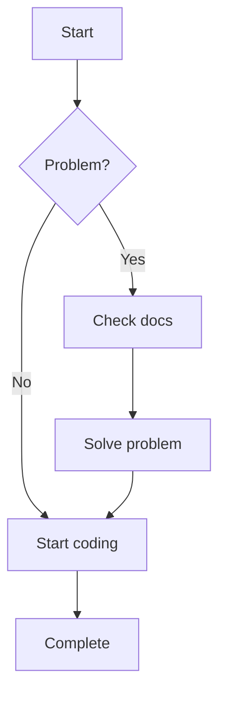

# Markdown Documentation System

English | [日本語](./README.ja.md) | [中文](./README.md)

A modern Markdown documentation management and preview system with support for Mermaid diagrams, global search, directory navigation, and more.

## ✨ Features

- 📝 **Markdown Support**: Full GitHub Flavored Markdown support
- 📊 **Mermaid Diagrams**: Built-in support for flowcharts, sequence diagrams, Gantt charts, etc.
- 🔍 **Global Search**: Powerful full-text search with keyword highlighting
- 🌲 **Directory Navigation**: Tree structure display with folder collapse/expand
- 📱 **Responsive Design**: Optimized for desktop and mobile devices
- 🔐 **Secure Management**: JWT authentication with password hashing
- ✏️ **Online Editing**: Powerful Markdown editor with real-time preview
- 📁 **File Management**: Drag-and-drop upload, create, edit, delete documents
- 🎯 **Drag & Drop**: Intuitive file operations with visual feedback
- 🔄 **File Renaming**: In-line editing with validation
- 👁️ **Hide/Show Files**: Admin-only visibility control
- 🚀 **Quick Edit**: Direct edit access from document preview

## 🚀 Quick Start

### Development Environment

1. **Clone the repository**
   ```bash
   git clone <repository-url>
   cd misonote-markdown
   ```

2. **Install dependencies**
   ```bash
   pnpm install
   ```

3. **Start development server**
   ```bash
   pnpm dev
   ```

4. **Access the application**
   - Document preview: http://localhost:3001
   - Admin interface: http://localhost:3001/admin (password: admin123)

### Production Deployment

1. **Environment Configuration**
   
   Copy `.env.example` to `.env.local` and configure the following variables:

   ```bash
   # JWT Secret - Must be set to a strong random string
   JWT_SECRET=your-super-secret-jwt-key-change-in-production
   
   # Admin password hash - Generated using bcrypt
   ADMIN_PASSWORD_HASH=$2a$12$LQv3c1yqBWVHxkd0LHAkCOYz6TtxMQJqhN8/LewdBPj/RK.s5uO.6
   
   # Environment setting
   NODE_ENV=production
   ```

2. **Generate Password Hash**
   
   Use the following command to generate a secure password hash:
   ```bash
   node -e "console.log(require('bcryptjs').hashSync('your-secure-password', 12))"
   ```

3. **Build the application**
   ```bash
   pnpm build
   ```

4. **Start production server**
   ```bash
   pnpm start
   ```

## 📁 Project Structure

```
src/
├── app/                    # Next.js App Router
│   ├── admin/             # Admin interface
│   ├── api/               # API routes
│   │   ├── auth/          # Authentication APIs
│   │   ├── admin/         # Admin functionality APIs
│   │   └── search/        # Search API
│   ├── docs/              # Document preview pages
│   └── globals.css        # Global styles
├── components/            # React components
│   ├── auth/              # Authentication components
│   ├── admin/             # Admin interface components
│   ├── Header.tsx         # Top navigation
│   ├── Sidebar.tsx        # Sidebar
│   ├── MarkdownRenderer.tsx # Markdown renderer
│   └── ...
├── lib/                   # Utility libraries
│   ├── auth.ts            # Authentication logic
│   ├── docs.ts            # Document processing
│   └── file-operations.ts # File operations
docs/                      # Markdown document storage directory
```

## 🔧 Configuration

### Environment Variables

| Variable | Required | Description |
|----------|----------|-------------|
| `JWT_SECRET` | Yes | JWT signing key, must be set in production |
| `ADMIN_PASSWORD_HASH` | Yes | bcrypt hash of admin password |
| `NODE_ENV` | No | Environment identifier, set to `production` for production |

### Security Recommendations

1. **JWT Secret**: Use at least 32 characters of random string
2. **Password Policy**: Use strong passwords, change regularly
3. **HTTPS**: Must use HTTPS in production
4. **Firewall**: Restrict admin interface access by IP

## 📖 Usage Guide

### Document Management

1. **Access admin interface**: `/admin`
2. **Login**: Use configured admin password
3. **Upload documents**: Drag `.md` files to upload area
4. **Create documents**: Click "+" button, select template to create
5. **Edit documents**: Click file name to enter editor
6. **Organize structure**: Use paths to organize document hierarchy
7. **Hide/Show files**: Right-click for visibility options

### Document Preview

1. **Browse documents**: Visit `/docs` to view document list
2. **Search functionality**: Use top search bar for quick finding
3. **Navigation**: Left tree navigation for document structure browsing
4. **Quick edit**: Click "Edit Document" button on any document page

### Advanced File Operations

1. **Drag & Drop**: Drag files to folders to move them
2. **Rename**: Double-click file names for inline editing
3. **Context Menu**: Right-click for additional options
4. **Visibility Control**: Hide sensitive documents from public view

### Mermaid Diagrams

Use Mermaid syntax in Markdown:

````markdown

````

## 🛠️ Development

### Tech Stack

- **Frontend**: Next.js 14, React, TypeScript, Tailwind CSS
- **Authentication**: JWT, bcryptjs
- **Markdown**: react-markdown, remark-gfm, rehype-highlight
- **Diagrams**: Mermaid
- **Search**: Fuse.js
- **Icons**: Lucide React

### Development Commands

```bash
# Development server
pnpm dev

# Build
pnpm build

# Start production server
pnpm start

# Lint
pnpm lint

# Type check
pnpm type-check
```

## 🏗️ Architecture

The system follows a modern, production-ready architecture:

- **Layered Architecture**: UI → API → Business Logic → Data
- **Security First**: JWT authentication, path validation, password hashing
- **Scalable Design**: Component-based, plugin-ready, type-safe
- **Performance Optimized**: Virtual scrolling, lazy loading, caching

## 📄 License

MIT License

## 🤝 Contributing

Issues and Pull Requests are welcome!

### Contributing Guidelines

1. Fork the project
2. Create a feature branch (`git checkout -b feature/AmazingFeature`)
3. Commit your changes (`git commit -m 'Add some AmazingFeature'`)
4. Push to the branch (`git push origin feature/AmazingFeature`)
5. Open a Pull Request

## 📞 Support

If you encounter issues or have suggestions:

1. Check [FAQ](./docs/faq.md)
2. Submit an [Issue](../../issues)
3. Review [Documentation](./docs)

## 🌟 Star History

If this project helps you, please consider giving it a star! ⭐

---

**Enjoy using the Markdown Documentation System!** 🎉
