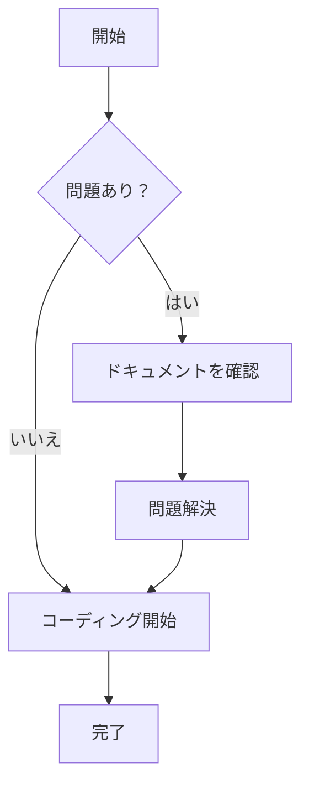

# Markdown ドキュメントシステム

[English](./README.en.md) | 日本語 | [中文](./README.md)

Mermaid図表、グローバル検索、ディレクトリナビゲーションなどをサポートする、モダンなMarkdownドキュメント管理・プレビューシステムです。

## ✨ 機能

- 📝 **Markdownサポート**: GitHub Flavored Markdownの完全サポート
- 📊 **Mermaid図表**: フローチャート、シーケンス図、ガントチャートなどの内蔵サポート
- 🔍 **グローバル検索**: キーワードハイライト付きの強力な全文検索
- 🌲 **ディレクトリナビゲーション**: フォルダの折りたたみ/展開をサポートするツリー構造表示
- 📱 **レスポンシブデザイン**: デスクトップとモバイルデバイスに最適化
- 🔐 **セキュアな管理**: パスワードハッシュ化によるJWT認証
- ✏️ **オンライン編集**: リアルタイムプレビュー付きの強力なMarkdownエディタ
- 📁 **ファイル管理**: ドラッグ&ドロップアップロード、作成、編集、削除
- 🎯 **ドラッグ&ドロップ**: 視覚的フィードバック付きの直感的なファイル操作
- 🔄 **ファイル名変更**: バリデーション付きのインライン編集
- 👁️ **ファイルの表示/非表示**: 管理者専用の表示制御
- 🚀 **クイック編集**: ドキュメントプレビューから直接編集アクセス

## 🚀 クイックスタート

### 開発環境

1. **リポジトリのクローン**
   ```bash
   git clone <repository-url>
   cd markdown-preview
   ```

2. **依存関係のインストール**
   ```bash
   pnpm install
   ```

3. **開発サーバーの起動**
   ```bash
   pnpm dev
   ```

4. **アプリケーションへのアクセス**
   - ドキュメントプレビュー: http://localhost:3001
   - 管理画面: http://localhost:3001/admin (パスワード: admin123)

### 本番環境デプロイ

1. **環境変数の設定**
   
   `.env.example`を`.env.local`にコピーし、以下の変数を設定してください：

   ```bash
   # JWT秘密鍵 - 強力なランダム文字列に設定する必要があります
   JWT_SECRET=your-super-secret-jwt-key-change-in-production
   
   # 管理者パスワードハッシュ - bcryptを使用して生成
   ADMIN_PASSWORD_HASH=$2a$12$LQv3c1yqBWVHxkd0LHAkCOYz6TtxMQJqhN8/LewdBPj/RK.s5uO.6
   
   # 環境設定
   NODE_ENV=production
   ```

2. **パスワードハッシュの生成**
   
   以下のコマンドを使用してセキュアなパスワードハッシュを生成してください：
   ```bash
   node -e "console.log(require('bcryptjs').hashSync('your-secure-password', 12))"
   ```

3. **アプリケーションのビルド**
   ```bash
   pnpm build
   ```

4. **本番サーバーの起動**
   ```bash
   pnpm start
   ```

## 📁 プロジェクト構造

```
src/
├── app/                    # Next.js App Router
│   ├── admin/             # 管理画面
│   ├── api/               # APIルート
│   │   ├── auth/          # 認証関連API
│   │   ├── admin/         # 管理機能API
│   │   └── search/        # 検索API
│   ├── docs/              # ドキュメントプレビューページ
│   └── globals.css        # グローバルスタイル
├── components/            # Reactコンポーネント
│   ├── auth/              # 認証コンポーネント
│   ├── admin/             # 管理画面コンポーネント
│   ├── Header.tsx         # トップナビゲーション
│   ├── Sidebar.tsx        # サイドバー
│   ├── MarkdownRenderer.tsx # Markdownレンダラー
│   └── ...
├── lib/                   # ユーティリティライブラリ
│   ├── auth.ts            # 認証ロジック
│   ├── docs.ts            # ドキュメント処理
│   └── file-operations.ts # ファイル操作
docs/                      # Markdownドキュメント保存ディレクトリ
```

## 🔧 設定

### 環境変数

| 変数名 | 必須 | 説明 |
|--------|------|------|
| `JWT_SECRET` | はい | JWT署名キー、本番環境では必須 |
| `ADMIN_PASSWORD_HASH` | はい | 管理者パスワードのbcryptハッシュ |
| `NODE_ENV` | いいえ | 環境識別子、本番環境では`production`に設定 |

### セキュリティ推奨事項

1. **JWT秘密鍵**: 最低32文字のランダム文字列を使用
2. **パスワードポリシー**: 強力なパスワードを使用し、定期的に変更
3. **HTTPS**: 本番環境では必ずHTTPSを使用
4. **ファイアウォール**: IPによる管理画面アクセス制限

## 📖 使用ガイド

### ドキュメント管理

1. **管理画面へのアクセス**: `/admin`
2. **ログイン**: 設定した管理者パスワードを使用
3. **ドキュメントのアップロード**: `.md`ファイルをアップロード領域にドラッグ
4. **ドキュメントの作成**: "+"ボタンをクリックし、テンプレートを選択して作成
5. **ドキュメントの編集**: ファイル名をクリックしてエディタに入る
6. **構造の整理**: パスを使用してドキュメント階層を整理
7. **ファイルの表示/非表示**: 右クリックで表示オプション

### ドキュメントプレビュー

1. **ドキュメントの閲覧**: `/docs`にアクセスしてドキュメントリストを表示
2. **検索機能**: トップの検索バーを使用して素早く検索
3. **ナビゲーション**: 左のツリーナビゲーションでドキュメント構造を閲覧
4. **クイック編集**: 任意のドキュメントページで「ドキュメントを編集」ボタンをクリック

### 高度なファイル操作

1. **ドラッグ&ドロップ**: ファイルをフォルダにドラッグして移動
2. **名前変更**: ファイル名をダブルクリックしてインライン編集
3. **コンテキストメニュー**: 右クリックで追加オプション
4. **表示制御**: 機密ドキュメントを公開ビューから非表示

### Mermaid図表

Markdownでmermaid構文を使用：

````markdown

````

## 🛠️ 開発

### 技術スタック

- **フロントエンド**: Next.js 14, React, TypeScript, Tailwind CSS
- **認証**: JWT, bcryptjs
- **Markdown**: react-markdown, remark-gfm, rehype-highlight
- **図表**: Mermaid
- **検索**: Fuse.js
- **アイコン**: Lucide React

### 開発コマンド

```bash
# 開発サーバー
pnpm dev

# ビルド
pnpm build

# 本番サーバー起動
pnpm start

# リント
pnpm lint

# 型チェック
pnpm type-check
```

## 🏗️ アーキテクチャ

システムはモダンで本番対応のアーキテクチャに従っています：

- **レイヤードアーキテクチャ**: UI → API → ビジネスロジック → データ
- **セキュリティファースト**: JWT認証、パス検証、パスワードハッシュ化
- **スケーラブルデザイン**: コンポーネントベース、プラグイン対応、型安全
- **パフォーマンス最適化**: 仮想スクロール、遅延読み込み、キャッシュ

## 📄 ライセンス

MIT License

## 🤝 コントリビューション

IssueやPull Requestを歓迎します！

### コントリビューションガイドライン

1. プロジェクトをフォーク
2. 機能ブランチを作成 (`git checkout -b feature/AmazingFeature`)
3. 変更をコミット (`git commit -m 'Add some AmazingFeature'`)
4. ブランチにプッシュ (`git push origin feature/AmazingFeature`)
5. Pull Requestを開く

## 📞 サポート

問題が発生した場合や提案がある場合：

1. [FAQ](./docs/faq.md)を確認
2. [Issue](../../issues)を提出
3. [ドキュメント](./docs)を確認

## 🌟 スター履歴

このプロジェクトが役に立った場合は、スターを付けることを検討してください！⭐

---

**Markdownドキュメントシステムをお楽しみください！** 🎉
