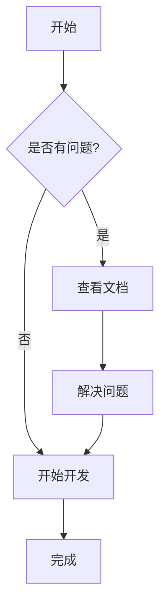

# Misonote Markdown - 现代化文档预览系统

[](https://github.com/leeguooooo/markdown-site)
[](https://github.com/leeguooooo/markdown-site)
[](https://github.com/leeguooooo/markdown-site/blob/main/LICENSE)
[](https://github.com/leeguooooo)

[English](./README.en.md) | [日本語](./README.ja.md) | 中文

一个现代化的 Markdown 文档管理和预览系统，支持 Mermaid 图表、全局搜索、目录导航等功能。

<div align="center">

**🐳 Docker 一键运行 | 📱 响应式设计 | 🔐 安全认证 | 💬 评论系统**

[](https://github.com/leeguooooo/markdown-site#-一键运行推荐)
[](https://hub.docker.com/r/leeguo/misonote-markdown)
[](./DOCKER-QUICKSTART.md)
[](https://your-demo-url.com)

</div>

> 🚀 **如果这个项目对你有帮助，请给个 ⭐ Star 支持一下！**

## 🎯 为什么选择这个项目？

- 🐳 **一键运行**: Docker 镜像开箱即用，无需安装 Node.js
- ✅ **多架构支持**: 支持 Intel/AMD 和 Apple Silicon 芯片
- ✅ **零配置部署**: 一条命令完成部署，自动配置环境变量
- ✅ **生产就绪**: 内置 PM2 支持，适合生产环境
- ✅ **安全可靠**: Base64 编码解决特殊字符问题，bcrypt 密码加密
- ✅ **现代技术栈**: Next.js 15 + React 19 + TypeScript

## ✨ 特性

- 📝 **Markdown 支持**: 完整支持 GitHub Flavored Markdown
- 📊 **Mermaid 图表**: 内置支持流程图、时序图、甘特图等
- 🔍 **全局搜索**: 强大的全文搜索功能，支持关键词高亮
- 🌲 **目录导航**: 树形结构显示，支持文件夹折叠展开
- 📱 **响应式设计**: 适配桌面和移动设备
- 🔐 **安全管理**: JWT 认证，密码哈希保护
- ✏️ **在线编辑**: 强大的 Markdown 编辑器，支持实时预览
- 📁 **文件管理**: 拖拽上传、创建、编辑、删除文档

## 🚀 快速开始

### 🐳 一键运行（推荐）

**无需安装 Node.js，无需克隆代码，一条命令即可运行！**

```bash
# 方式一：使用默认临时密码 (admin123)
docker run -d \
  --name misonote-markdown \
  -p 3001:3001 \
  -v $(pwd)/docs:/app/docs \
  -v $(pwd)/data:/app/data \
  leeguo/misonote-markdown:latest

# 方式二：启动时设置自定义密码（推荐）
docker run -d \
  --name misonote-markdown \
  -p 3001:3001 \
  -e ADMIN_PASSWORD=your_secure_password \
  -v $(pwd)/docs:/app/docs \
  -v $(pwd)/data:/app/data \
  leeguo/misonote-markdown:latest
```

**立即访问**: http://localhost:3001
**管理后台**: http://localhost:3001/admin
**默认密码**: admin123 (如未设置 ADMIN_PASSWORD)

#### 🔧 常用管理命令

```bash
# 查看容器状态
docker ps

# 查看应用日志
docker logs misonote-markdown

# 停止应用
docker stop misonote-markdown

# 重启应用
docker restart misonote-markdown

# 进入容器
docker exec -it misonote-markdown sh

# 删除容器
docker rm -f misonote-markdown
```

#### 🔧 使用 Docker Compose（推荐生产环境）

```bash
# 下载配置文件
curl -O https://raw.githubusercontent.com/leeguooooo/markdown-site/main/docker-compose.yml

# 启动服务
docker-compose up -d

# 查看状态
docker-compose ps
```

#### 📦 Docker Hub 镜像信息

- **镜像地址**: `leeguo/misonote-markdown`
- **支持架构**: AMD64 (Intel/AMD) + ARM64 (Apple Silicon)
- **镜像大小**: 优化后的 Alpine Linux 基础镜像
- **更新频率**: 跟随项目版本发布

### 开发环境

如果您想参与开发或自定义功能：

1. **克隆项目**
   ```bash
   git clone https://github.com/leeguooooo/markdown-site
   cd markdown-site
   ```

2. **安装依赖**
   ```bash
   # 方式一：一键安装（推荐，自动处理构建脚本）
   pnpm run install:full

   # 方式二：标准安装
   pnpm install

   # 如果看到 better-sqlite3 构建脚本警告，执行以下命令：
   pnpm approve-builds
   # 然后选择 better-sqlite3（按空格选择，回车确认）
   ```

   > 💡 **提示**: better-sqlite3 需要编译原生模块，这是正常的。选择批准后即可正常使用。

3. **启动开发服务器**
   ```bash
   pnpm dev
   ```

4. **访问应用**
   - 文档预览: http://localhost:3001
   - 管理界面: http://localhost:3001/admin (密码: admin123)

### 其他部署方式

#### 🐳 本地构建 Docker

如果您想自己构建镜像：

```bash
# 克隆项目
git clone https://github.com/leeguooooo/markdown-site
cd markdown-site

# 一键 Docker 部署
pnpm docker:deploy
```

#### 🚀 传统部署

使用我们提供的安全构建脚本，自动检查环境变量并部署：

```bash
# 克隆项目
git clone https://github.com/leeguooooo/markdown-site
cd markdown-site

# 安装依赖（一键安装，自动处理构建脚本）
pnpm run install:full

# 一键安全构建（自动配置环境变量）
pnpm build:safe

# 启动 PM2 服务
pnpm pm2:start
```

#### 📋 手动部署

如果你想手动控制每个步骤：

1. **设置管理员密码**
   ```bash
   # 交互式设置密码
   pnpm security:setup
   ```

2. **构建应用**
   ```bash
   # 普通构建
   pnpm build

   # 或安全构建（包含环境检查）
   pnpm build:safe
   ```

3. **启动服务**
   ```bash
   # 使用 PM2 启动（推荐）
   pnpm pm2:start

   # 或直接启动
   pnpm start
   ```

#### 🔧 部署管理

```bash
# 查看服务状态
pnpm pm2:status

# 查看日志
pnpm pm2:logs

# 重启服务
pnpm pm2:restart

# 停止服务
pnpm pm2:stop
```

#### 🛠️ 故障排除

如果遇到问题：

```bash
# 验证密码设置
pnpm security:verify

# 检查环境变量
node scripts/pre-build-check.js

# 清理并重新构建
pnpm clean
pnpm build:safe
```

## 📁 项目结构

```
├── src/                   # 源代码目录
│   ├── app/              # Next.js App Router
│   │   ├── admin/        # 管理界面
│   │   ├── api/          # API 路由
│   │   └── docs/         # 文档预览页面
│   ├── components/       # React 组件
│   │   ├── auth/         # 认证组件
│   │   ├── admin/        # 管理界面组件
│   │   ├── ui/           # 基础 UI 组件
│   │   └── docs/         # 文档相关组件
│   └── lib/              # 工具库
│       ├── auth.ts       # 认证逻辑
│       ├── logger.ts     # 日志系统
│       └── utils.ts      # 工具函数
├── scripts/              # 核心脚本目录（已简化）
│   ├── pre-build-check.js    # 构建前环境检查
│   ├── generate-password.js  # 密码生成工具
│   ├── verify-password.js    # 密码验证工具
│   ├── safe-build.sh         # 安全构建脚本
│   ├── docker-publish.sh     # Docker 镜像发布脚本
│   └── docker-entrypoint.sh  # Docker 容器启动脚本
├── docs/                 # 文档目录
│   ├── 示例文档/         # 示例和演示文档
│   ├── security/         # 安全相关文档
│   └── 项目文档/         # 项目说明文档
├── public/               # 静态资源
├── .env                  # 环境变量配置
├── Dockerfile            # Docker 镜像构建文件
├── docker-compose.yml    # Docker Compose 配置
├── ecosystem.config.js   # PM2 配置文件
├── SETUP.md              # 详细设置指南
└── package.json          # 项目配置
```

## 🔧 配置说明

### 环境变量

系统会自动生成以下环境变量，无需手动配置：

| 变量名 | 说明 | 默认值 |
|--------|------|--------|
| `ADMIN_PASSWORD_HASH_BASE64` | 管理员密码哈希（Base64编码） | 自动生成 |
| `JWT_SECRET` | JWT 签名密钥 | 自动生成 |
| `NODE_ENV` | 运行环境 | `production` |
| `PORT` | 服务端口 | `3001` |

> 💡 **提示**: 使用 Base64 编码避免了特殊字符在环境变量中的解析问题

### 安全建议

1. **JWT 密钥**: 使用至少 32 位的随机字符串
2. **密码策略**: 使用强密码，定期更换
3. **HTTPS**: 生产环境必须使用 HTTPS
4. **防火墙**: 限制管理界面的访问 IP

## 📖 使用指南

### 🚀 快速体验

使用 Docker 一键运行后，您可以：

1. **立即访问**: 打开 http://localhost:3001
2. **管理后台**: 访问 http://localhost:3001/admin
3. **默认密码**: admin123 (首次登录后请修改)

### 文档管理

1. **访问管理界面**: `/admin`
2. **登录**: 使用配置的管理员密码
3. **上传文档**: 拖拽 `.md` 文件到上传区域
4. **创建文档**: 点击 "+" 按钮，选择模板创建
5. **编辑文档**: 点击文件名进入编辑器
6. **组织结构**: 使用路径来组织文档层级

### 文档预览

1. **浏览文档**: 访问 `/docs` 查看文档列表
2. **搜索功能**: 使用顶部搜索框快速查找
3. **导航**: 左侧树形导航浏览文档结构

### Mermaid 图表

在 Markdown 中使用 Mermaid 语法：

````markdown

````

## 🛠️ 开发

### 技术栈

- **前端**: Next.js 14, React, TypeScript, Tailwind CSS
- **认证**: JWT, bcryptjs
- **Markdown**: react-markdown, remark-gfm, rehype-highlight
- **图表**: Mermaid
- **搜索**: Fuse.js
- **图标**: Lucide React

### 开发命令

```bash
# 开发服务器
pnpm dev

# 构建
pnpm build

# 启动生产服务器
pnpm start

# 代码检查
pnpm lint

# 类型检查
pnpm type-check
```

### 可用命令

项目提供了简化的命令来管理部署：

```bash
# 🚀 开发命令
pnpm dev                    # 启动开发服务器
pnpm build                  # 构建生产版本
pnpm build:safe             # 安全构建（包含环境检查）
pnpm build:docker           # Docker 构建
pnpm start                  # 启动生产服务器
pnpm lint                   # 代码检查

# 🐳 Docker 部署
pnpm docker:deploy          # 一键 Docker 部署
pnpm docker:build           # 构建 Docker 镜像
pnpm docker:compose         # 启动 Docker Compose
pnpm docker:logs            # 查看 Docker 日志
pnpm docker:stop            # 停止 Docker 服务
pnpm docker:restart         # 重启 Docker 服务
pnpm docker:manage          # Docker 管理工具

# 📦 Docker 镜像发布
pnpm docker:publish:check   # 发布前检查
pnpm docker:publish:prepare # 发布准备
pnpm docker:publish         # 发布镜像到 Docker Hub

# 🔐 安全管理
pnpm security:setup         # 设置管理员密码
pnpm security:verify        # 验证管理员密码

# 🚀 PM2 部署
pnpm pm2:start              # 启动 PM2 服务
pnpm pm2:stop               # 停止 PM2 服务
pnpm pm2:restart            # 重启 PM2 服务
pnpm pm2:logs               # 查看 PM2 日志
pnpm pm2:status             # 查看 PM2 状态

# 🧹 清理
pnpm clean                  # 清理构建文件和日志
```

详细说明请查看：[设置指南](./SETUP.md)

## 📄 许可证

MIT License

## 🤝 贡献

欢迎提交 Issue 和 Pull Request！

### 贡献指南

1. Fork 项目
2. 创建功能分支 (`git checkout -b feature/AmazingFeature`)
3. 提交更改 (`git commit -m 'Add some AmazingFeature'`)
4. 推送到分支 (`git push origin feature/AmazingFeature`)
5. 开启 Pull Request

## 📞 支持

### 🐳 Docker 常见问题

**Q: 如何自定义端口？**
```bash
docker run -d -p 8080:3001 --name misonote-markdown leeguo/misonote-markdown:latest
# 然后访问 http://localhost:8080
```

**Q: 如何持久化数据？**
```bash
# 创建本地目录
mkdir -p ./my-docs ./my-data

# 挂载到容器
docker run -d \
  -p 3001:3001 \
  -v $(pwd)/my-docs:/app/docs \
  -v $(pwd)/my-data:/app/data \
  --name misonote-markdown \
  leeguo/misonote-markdown:latest
```

**Q: 如何设置管理员密码？**
```bash
# 方式一：启动时设置（推荐）
docker run -d \
  -e ADMIN_PASSWORD=your_secure_password \
  -p 3001:3001 \
  --name misonote-markdown \
  leeguo/misonote-markdown:latest

# 方式二：启动后修改
docker exec -it misonote-markdown node scripts/generate-password.js
docker restart misonote-markdown
```

**Q: 如何查看详细日志？**
```bash
# 查看应用日志
docker logs -f misonote-markdown

# 查看容器内日志文件
docker exec misonote-markdown cat logs/app.log
```

### 其他支持

如果你遇到问题或有建议，请：

1. 查看 [常见问题](./docs/faq.md)
2. 提交 [Issue](../../issues)
3. 查看 [文档](./docs)
4. 访问 [Docker Hub](https://hub.docker.com/r/leeguo/misonote-markdown)

---

## 👨‍💻 作者

**leeguoo** - [GitHub](https://github.com/leeguooooo) | [个人主页](docs/关于作者/leeguoo.md)

## 🌟 致谢

感谢所有为这个项目做出贡献的开发者！

**享受使用 Markdown 文档系统！** 🎉
