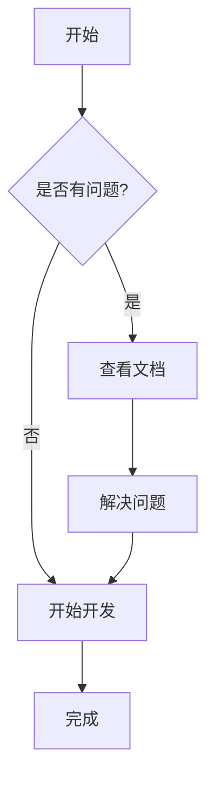

# Markdown 文档预览系统

[English](./README.en.md) | [日本語](./README.ja.md) | 中文

一个现代化的 Markdown 文档管理和预览系统，支持 Mermaid 图表、全局搜索、目录导航等功能。

## ✨ 特性

- 📝 **Markdown 支持**: 完整支持 GitHub Flavored Markdown
- 📊 **Mermaid 图表**: 内置支持流程图、时序图、甘特图等
- 🔍 **全局搜索**: 强大的全文搜索功能，支持关键词高亮
- 🌲 **目录导航**: 树形结构显示，支持文件夹折叠展开
- 📱 **响应式设计**: 适配桌面和移动设备
- 🔐 **安全管理**: JWT 认证，密码哈希保护
- ✏️ **在线编辑**: 强大的 Markdown 编辑器，支持实时预览
- 📁 **文件管理**: 拖拽上传、创建、编辑、删除文档

## 🚀 快速开始

### 开发环境

1. **克隆项目**
   ```bash
   git clone <repository-url>
   cd markdown-preview
   ```

2. **安装依赖**
   ```bash
   pnpm install
   ```

3. **启动开发服务器**
   ```bash
   pnpm dev
   ```

4. **访问应用**
   - 文档预览: http://localhost:3001
   - 管理界面: http://localhost:3001/admin (密码: admin123)

### 生产环境部署

1. **环境变量配置**

   复制 `.env.example` 为 `.env.local` 并配置以下变量：

   ```bash
   # JWT 密钥 - 必须设置为强随机字符串
   JWT_SECRET=your-super-secret-jwt-key-change-in-production

   # 管理员密码哈希 - 使用 bcrypt 生成
   ADMIN_PASSWORD_HASH=$2a$12$LQv3c1yqBWVHxkd0LHAkCOYz6TtxMQJqhN8/LewdBPj/RK.s5uO.6

   # 环境设置
   NODE_ENV=production
   ```

2. **生成密码哈希**

   使用以下命令生成安全的密码哈希：
   ```bash
   node -e "console.log(require('bcryptjs').hashSync('your-secure-password', 12))"
   ```

3. **构建应用**
   ```bash
   pnpm build
   ```

4. **启动生产服务器**
   ```bash
   pnpm start
   ```

## 📁 项目结构

```
src/
├── app/                    # Next.js App Router
│   ├── admin/             # 管理界面
│   ├── api/               # API 路由
│   │   ├── auth/          # 认证相关 API
│   │   ├── admin/         # 管理功能 API
│   │   └── search/        # 搜索 API
│   ├── docs/              # 文档预览页面
│   └── globals.css        # 全局样式
├── components/            # React 组件
│   ├── auth/              # 认证组件
│   ├── admin/             # 管理界面组件
│   ├── Header.tsx         # 顶部导航
│   ├── Sidebar.tsx        # 侧边栏
│   ├── MarkdownRenderer.tsx # Markdown 渲染器
│   └── ...
├── lib/                   # 工具库
│   ├── auth.ts            # 认证逻辑
│   └── docs.ts            # 文档处理
docs/                      # Markdown 文档存储目录
```

## 🔧 配置说明

### 环境变量

| 变量名 | 必填 | 说明 |
|--------|------|------|
| `JWT_SECRET` | 是 | JWT 签名密钥，生产环境必须设置 |
| `ADMIN_PASSWORD_HASH` | 是 | 管理员密码的 bcrypt 哈希值 |
| `NODE_ENV` | 否 | 环境标识，生产环境设为 `production` |

### 安全建议

1. **JWT 密钥**: 使用至少 32 位的随机字符串
2. **密码策略**: 使用强密码，定期更换
3. **HTTPS**: 生产环境必须使用 HTTPS
4. **防火墙**: 限制管理界面的访问 IP

## 📖 使用指南

### 文档管理

1. **访问管理界面**: `/admin`
2. **登录**: 使用配置的管理员密码
3. **上传文档**: 拖拽 `.md` 文件到上传区域
4. **创建文档**: 点击 "+" 按钮，选择模板创建
5. **编辑文档**: 点击文件名进入编辑器
6. **组织结构**: 使用路径来组织文档层级

### 文档预览

1. **浏览文档**: 访问 `/docs` 查看文档列表
2. **搜索功能**: 使用顶部搜索框快速查找
3. **导航**: 左侧树形导航浏览文档结构

### Mermaid 图表

在 Markdown 中使用 Mermaid 语法：

````markdown

````

## 🛠️ 开发

### 技术栈

- **前端**: Next.js 14, React, TypeScript, Tailwind CSS
- **认证**: JWT, bcryptjs
- **Markdown**: react-markdown, remark-gfm, rehype-highlight
- **图表**: Mermaid
- **搜索**: Fuse.js
- **图标**: Lucide React

### 开发命令

```bash
# 开发服务器
pnpm dev

# 构建
pnpm build

# 启动生产服务器
pnpm start

# 代码检查
pnpm lint

# 类型检查
pnpm type-check
```

## 📄 许可证

MIT License

## 🤝 贡献

欢迎提交 Issue 和 Pull Request！

### 贡献指南

1. Fork 项目
2. 创建功能分支 (`git checkout -b feature/AmazingFeature`)
3. 提交更改 (`git commit -m 'Add some AmazingFeature'`)
4. 推送到分支 (`git push origin feature/AmazingFeature`)
5. 开启 Pull Request

## 📞 支持

如果你遇到问题或有建议，请：

1. 查看 [常见问题](./docs/faq.md)
2. 提交 [Issue](../../issues)
3. 查看 [文档](./docs)

---

**享受使用 Markdown 文档系统！** 🎉
