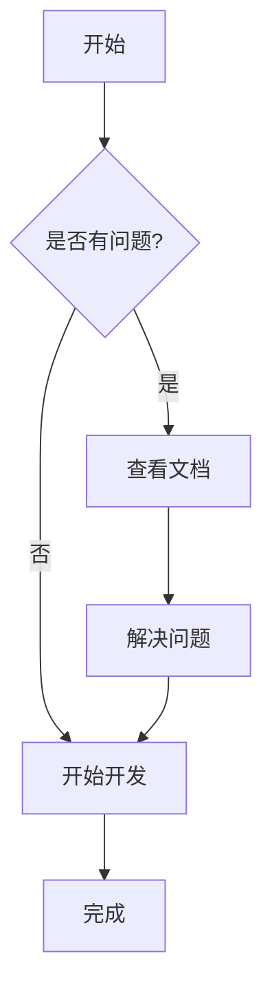

# 现代化 Markdown 文档预览系统

[](https://github.com/leeguooooo/markdown-site)
[](https://github.com/leeguooooo/markdown-site)
[](https://github.com/leeguooooo/markdown-site/blob/main/LICENSE)
[](https://github.com/leeguooooo)

[English](./README.en.md) | [日本語](./README.ja.md) | 中文

一个现代化的 Markdown 文档管理和预览系统，支持 Mermaid 图表、全局搜索、目录导航等功能。

> 🚀 **如果这个项目对你有帮助，请给个 ⭐ Star 支持一下！**

## ✨ 特性

- 📝 **Markdown 支持**: 完整支持 GitHub Flavored Markdown
- 📊 **Mermaid 图表**: 内置支持流程图、时序图、甘特图等
- 🔍 **全局搜索**: 强大的全文搜索功能，支持关键词高亮
- 🌲 **目录导航**: 树形结构显示，支持文件夹折叠展开
- 📱 **响应式设计**: 适配桌面和移动设备
- 🔐 **安全管理**: JWT 认证，密码哈希保护
- ✏️ **在线编辑**: 强大的 Markdown 编辑器，支持实时预览
- 📁 **文件管理**: 拖拽上传、创建、编辑、删除文档

## 🚀 快速开始

### 开发环境

1. **克隆项目**
   ```bash
   git clone https://github.com/leeguooooo/markdown-site
   cd markdown-site
   ```

2. **安装依赖**
   ```bash
   pnpm install
   ```

3. **启动开发服务器**
   ```bash
   pnpm dev
   ```

4. **访问应用**
   - 文档预览: http://localhost:3001
   - 管理界面: http://localhost:3001/admin (密码: admin123)

### 生产环境部署

#### 快速部署

使用我们提供的脚本快速部署：

```bash
# 1. 快速启动脚本
bash scripts/quick-start.sh

# 2. 或者使用安全配置脚本
bash scripts/security/update-security.sh
```

#### 手动部署

1. **环境变量配置**

   复制 `.env.example` 为 `.env` 并配置变量，或使用脚本生成：

   ```bash
   # 使用脚本生成密码哈希
   node scripts/security/generate-password-hash.js
   ```

2. **构建应用**
   ```bash
   pnpm build
   ```

3. **启动生产服务器**
   ```bash
   # 使用 PM2 启动
   node scripts/deployment/pm2-start.js

   # 或直接启动
   pnpm start
   ```

#### 部署故障排除

如果遇到环境变量问题：

```bash
# 修复环境变量加载问题
bash scripts/security/fix-env-loading.sh

# 验证密码设置
node scripts/security/verify-password.js
```

## 📁 项目结构

```
├── src/                   # 源代码目录
│   ├── app/              # Next.js App Router
│   │   ├── admin/        # 管理界面
│   │   ├── api/          # API 路由
│   │   └── docs/         # 文档预览页面
│   ├── components/       # React 组件
│   │   ├── auth/         # 认证组件
│   │   ├── admin/        # 管理界面组件
│   │   └── ...           # 其他组件
│   └── lib/              # 工具库
│       ├── auth.ts       # 认证逻辑
│       └── docs.ts       # 文档处理
├── scripts/              # 脚本工具目录
│   ├── deployment/       # 部署相关脚本
│   │   ├── pm2-start.js  # PM2 启动脚本
│   │   └── start-pm2.sh  # Shell 启动脚本
│   ├── security/         # 安全相关脚本
│   │   ├── update-security.sh      # 安全配置脚本
│   │   ├── generate-password-hash.js # 密码生成工具
│   │   ├── verify-password.js      # 密码验证工具
│   │   └── fix-env-loading.sh      # 环境变量修复
│   ├── development/      # 开发相关脚本
│   │   ├── debug-env.js  # 环境变量调试
│   │   └── test-login.sh # 登录测试
│   ├── quick-start.sh    # 快速启动脚本
│   └── README.md         # 脚本说明文档
├── docs/                 # 文档目录
│   ├── security/         # 安全相关文档
│   ├── deployment/       # 部署相关文档
│   ├── development/      # 开发相关文档
│   ├── 示例文档/         # 示例和演示文档
│   └── README.md         # 文档说明
├── public/               # 静态资源
├── ecosystem.config.js   # PM2 配置文件
└── package.json          # 项目配置
```

## 🔧 配置说明

### 环境变量

| 变量名 | 必填 | 说明 |
|--------|------|------|
| `JWT_SECRET` | 是 | JWT 签名密钥，生产环境必须设置 |
| `ADMIN_PASSWORD_HASH` | 是 | 管理员密码的 bcrypt 哈希值 |
| `NODE_ENV` | 否 | 环境标识，生产环境设为 `production` |

### 安全建议

1. **JWT 密钥**: 使用至少 32 位的随机字符串
2. **密码策略**: 使用强密码，定期更换
3. **HTTPS**: 生产环境必须使用 HTTPS
4. **防火墙**: 限制管理界面的访问 IP

## 📖 使用指南

### 文档管理

1. **访问管理界面**: `/admin`
2. **登录**: 使用配置的管理员密码
3. **上传文档**: 拖拽 `.md` 文件到上传区域
4. **创建文档**: 点击 "+" 按钮，选择模板创建
5. **编辑文档**: 点击文件名进入编辑器
6. **组织结构**: 使用路径来组织文档层级

### 文档预览

1. **浏览文档**: 访问 `/docs` 查看文档列表
2. **搜索功能**: 使用顶部搜索框快速查找
3. **导航**: 左侧树形导航浏览文档结构

### Mermaid 图表

在 Markdown 中使用 Mermaid 语法：

````markdown

````

## 🛠️ 开发

### 技术栈

- **前端**: Next.js 14, React, TypeScript, Tailwind CSS
- **认证**: JWT, bcryptjs
- **Markdown**: react-markdown, remark-gfm, rehype-highlight
- **图表**: Mermaid
- **搜索**: Fuse.js
- **图标**: Lucide React

### 开发命令

```bash
# 开发服务器
pnpm dev

# 构建
pnpm build

# 启动生产服务器
pnpm start

# 代码检查
pnpm lint

# 类型检查
pnpm type-check
```

### 脚本工具

项目提供了丰富的脚本工具来简化部署和管理：

```bash
# 🚀 快速启动（推荐）
bash scripts/quick-start.sh

# 🔐 安全配置
bash scripts/security/update-security.sh          # 交互式设置管理员密码
node scripts/security/generate-password-hash.js   # 生成密码哈希
node scripts/security/verify-password.js          # 验证密码

# 🚀 部署相关
node scripts/deployment/pm2-start.js              # PM2 启动脚本
bash scripts/deployment/start-pm2.sh              # Shell 启动脚本

# 🔧 故障排除
bash scripts/security/fix-env-loading.sh          # 修复环境变量问题
node scripts/development/debug-env.js             # 调试环境变量
bash scripts/development/test-login.sh            # 测试登录功能
```

详细说明请查看：
- [脚本说明文档](./scripts/README.md)
- [安全配置指南](./docs/security/README-SECURITY.md)

## 📄 许可证

MIT License

## 🤝 贡献

欢迎提交 Issue 和 Pull Request！

### 贡献指南

1. Fork 项目
2. 创建功能分支 (`git checkout -b feature/AmazingFeature`)
3. 提交更改 (`git commit -m 'Add some AmazingFeature'`)
4. 推送到分支 (`git push origin feature/AmazingFeature`)
5. 开启 Pull Request

## 📞 支持

如果你遇到问题或有建议，请：

1. 查看 [常见问题](./docs/faq.md)
2. 提交 [Issue](../../issues)
3. 查看 [文档](./docs)

---

## 👨‍💻 作者

**leeguoo** - [GitHub](https://github.com/leeguooooo) | [个人主页](docs/关于作者/leeguoo.md)

## 🌟 致谢

感谢所有为这个项目做出贡献的开发者！

**享受使用 Markdown 文档系统！** 🎉
