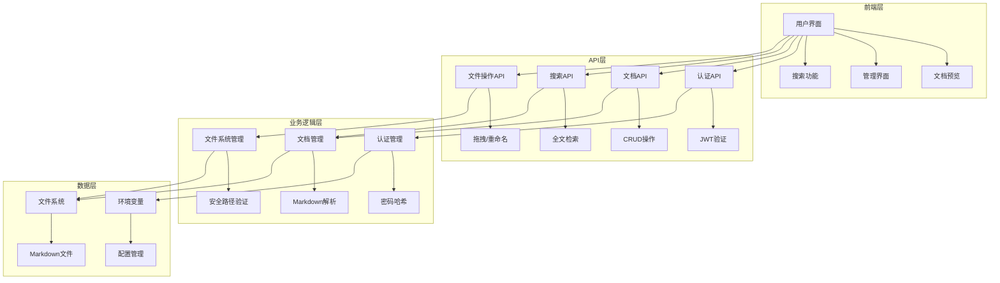
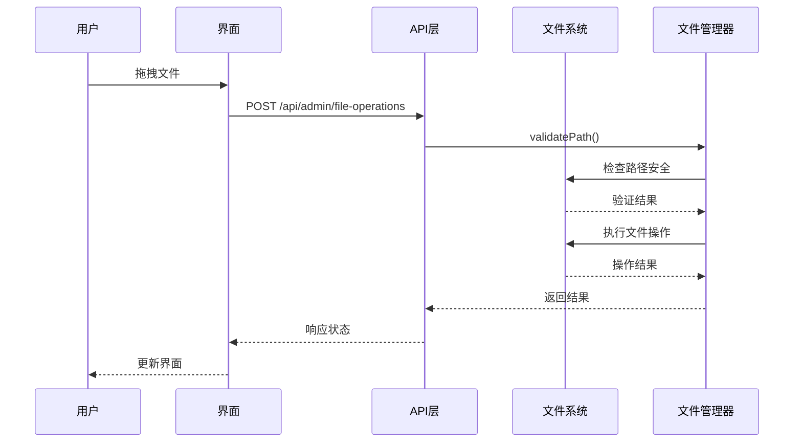

# 系统架构设计

## 🏗️ 整体架构

本系统采用现代化的前后端一体化架构，基于 Next.js 14 App Router 构建，具备生产级的安全性和可扩展性。



## 📁 目录结构设计

### 核心原则
1. **关注点分离**: 按功能模块组织代码
2. **可维护性**: 清晰的层次结构
3. **可扩展性**: 易于添加新功能
4. **类型安全**: 完整的 TypeScript 支持

### 目录说明

```
src/
├── app/                    # Next.js App Router
│   ├── admin/             # 管理界面路由
│   ├── api/               # API 路由
│   │   ├── auth/          # 认证相关
│   │   ├── admin/         # 管理功能
│   │   └── search/        # 搜索功能
│   ├── docs/              # 文档预览路由
│   └── globals.css        # 全局样式
├── components/            # React 组件
│   ├── auth/              # 认证组件
│   ├── admin/             # 管理界面组件
│   ├── ui/                # 通用UI组件
│   └── ...                # 其他功能组件
├── lib/                   # 工具库和业务逻辑
│   ├── auth.ts            # 认证逻辑
│   ├── docs.ts            # 文档处理
│   └── file-operations.ts # 文件操作
└── types/                 # TypeScript 类型定义
```

## 🔐 安全架构

### 认证系统
- **JWT Token**: 无状态认证
- **bcrypt 哈希**: 密码安全存储
- **环境变量**: 敏感信息隔离
- **路径验证**: 防止目录遍历攻击

### 安全措施
```typescript
// 路径安全验证
private validatePath(filePath: string): boolean {
  const resolvedPath = path.resolve(this.basePath, filePath);
  return resolvedPath.startsWith(this.basePath);
}

// JWT 认证中间件
export function authenticateRequest(request: NextRequest) {
  const token = request.headers.get('authorization')?.replace('Bearer ', '');
  if (!token) return null;
  
  try {
    return jwt.verify(token, JWT_SECRET) as { userId: string };
  } catch {
    return null;
  }
}
```

## 📊 数据流设计

### 文件管理流程


### 状态管理
- **本地状态**: React useState/useEffect
- **全局状态**: Context API (未来可扩展 Zustand)
- **服务器状态**: SWR/React Query (未来优化)

## 🎨 组件架构

### 设计原则
1. **单一职责**: 每个组件只负责一个功能
2. **可复用性**: 通用组件抽象
3. **类型安全**: 完整的 Props 类型定义
4. **性能优化**: 合理使用 memo 和 callback

### 组件层次
```
AdminPage (容器组件)
├── EnhancedFileTree (文件树)
│   ├── TreeNode (树节点)
│   ├── ContextMenu (右键菜单)
│   └── RenameInput (重命名输入)
├── MarkdownEditor (编辑器)
│   ├── Toolbar (工具栏)
│   ├── Editor (编辑区)
│   └── Preview (预览区)
├── DragDropUpload (拖拽上传)
└── CreateFileDialog (创建文件对话框)
```

## 🚀 性能优化策略

### 前端优化
- **代码分割**: 动态导入大型组件
- **图片优化**: Next.js Image 组件
- **缓存策略**: 浏览器缓存和 CDN
- **懒加载**: 虚拟滚动大型列表

### 后端优化
- **文件缓存**: 内存缓存常用文档
- **增量更新**: 只更新变更的文件
- **压缩传输**: Gzip 压缩
- **并发处理**: 异步文件操作

## 🔄 扩展性设计

### 插件系统 (未来)
```typescript
interface Plugin {
  name: string;
  version: string;
  init: (app: Application) => void;
  destroy: () => void;
}

// 插件注册
class PluginManager {
  private plugins: Map<string, Plugin> = new Map();
  
  register(plugin: Plugin) {
    this.plugins.set(plugin.name, plugin);
    plugin.init(this.app);
  }
}
```

### 数据库支持 (未来)
- **SQLite**: 轻量级部署
- **PostgreSQL**: 生产环境
- **MongoDB**: 文档存储

### 多租户支持 (未来)
- **用户管理**: 多用户权限
- **空间隔离**: 租户数据隔离
- **配额管理**: 存储和功能限制

## 📈 监控和日志

### 错误监控
- **Sentry**: 错误追踪
- **日志系统**: 结构化日志
- **性能监控**: Core Web Vitals

### 运维支持
- **健康检查**: API 健康状态
- **指标收集**: Prometheus 兼容
- **告警系统**: 异常通知

## 🧪 测试策略

### 测试金字塔
```
E2E Tests (Playwright)
├── 用户流程测试
└── 跨浏览器测试

Integration Tests (Jest)
├── API 集成测试
└── 组件集成测试

Unit Tests (Jest + Testing Library)
├── 工具函数测试
├── 组件单元测试
└── 业务逻辑测试
```

### 测试覆盖率目标
- **单元测试**: > 80%
- **集成测试**: > 60%
- **E2E 测试**: 核心用户流程

## 🚢 部署架构

### 容器化部署
```dockerfile
FROM node:18-alpine
WORKDIR /app
COPY package*.json ./
RUN npm ci --only=production
COPY . .
RUN npm run build
EXPOSE 3000
CMD ["npm", "start"]
```

### 环境配置
- **开发环境**: 本地开发服务器
- **测试环境**: Docker Compose
- **生产环境**: Kubernetes/Docker Swarm

### CI/CD 流程
```yaml
# GitHub Actions 示例
name: Deploy
on:
  push:
    branches: [main]
jobs:
  test:
    runs-on: ubuntu-latest
    steps:
      - uses: actions/checkout@v3
      - run: npm ci
      - run: npm test
      - run: npm run build
  deploy:
    needs: test
    runs-on: ubuntu-latest
    steps:
      - run: docker build -t app .
      - run: docker push registry/app
```

## 📋 技术债务管理

### 当前技术债务
1. **状态管理**: 需要引入全局状态管理
2. **缓存策略**: 需要实现智能缓存
3. **测试覆盖**: 需要补充测试用例
4. **文档完善**: 需要补充 API 文档

### 重构计划
- **Q1**: 引入状态管理库
- **Q2**: 实现缓存系统
- **Q3**: 完善测试覆盖
- **Q4**: 性能优化

---

这个架构设计确保了系统的**可维护性**、**可扩展性**和**安全性**，为未来的功能扩展和性能优化奠定了坚实的基础。
