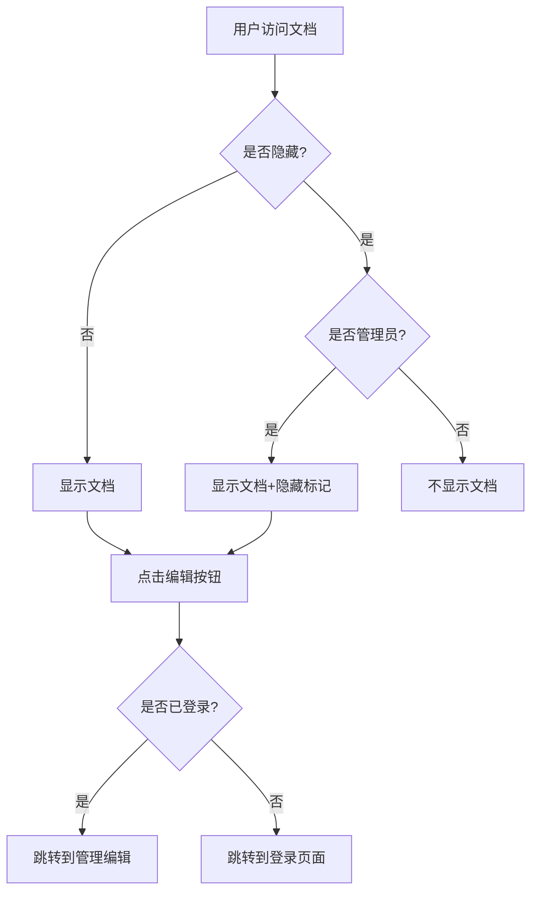

# 功能演示文档

这是一个演示文档，展示了系统的各种新功能。

## 🎯 新增功能

### 1. 文件夹创建和管理
- ✅ 在根目录创建文件夹
- ✅ 拖拽文件到文件夹移动
- ✅ 右键菜单操作

### 2. 文件隐藏功能
- ✅ 管理员可以隐藏/显示文件
- ✅ 隐藏文件在公共视图中不可见
- ✅ 管理员界面显示隐藏状态

### 3. 快速编辑功能
- ✅ 文档预览页面的"编辑文档"按钮
- ✅ 直接跳转到管理编辑界面
- ✅ 自动选中对应文档

### 4. 拖拽和重命名
- ✅ 拖拽文件移动到文件夹
- ✅ 双击文件名进行重命名
- ✅ 实时验证和错误提示

## 🌍 多语言支持

项目现在支持三种语言的 README：
- 🇨🇳 中文 (README.md)
- 🇺🇸 英文 (README.en.md)  
- 🇯🇵 日文 (README.ja.md)

## 🏗️ 架构亮点

### 安全设计
```typescript
// 路径安全验证
private validatePath(filePath: string): boolean {
  const resolvedPath = path.resolve(this.basePath, filePath);
  return resolvedPath.startsWith(this.basePath);
}
```

### 文件操作
```typescript
// 隐藏状态切换
async toggleHidden(filePath: string): Promise<void> {
  const metadata = this.getMetadata(filePath);
  metadata.isHidden = !metadata.isHidden;
  this.saveMetadata(filePath, metadata);
}
```

## 📊 系统流程图



## 🎨 用户体验

### 视觉反馈
- 拖拽时的高亮效果
- 隐藏文件的灰色显示
- 操作成功的提示信息

### 交互设计
- 右键菜单的上下文操作
- 双击重命名的直观操作
- 拖拽移动的自然交互

## 🚀 开源准备

项目已经完全准备好开源：

1. ✅ 完整的功能实现
2. ✅ 生产级安全性
3. ✅ 多语言文档
4. ✅ 清晰的架构设计
5. ✅ 详细的使用说明

## 📝 测试建议

1. **文件管理测试**
   - 创建文件夹
   - 拖拽文件移动
   - 重命名文件/文件夹
   - 隐藏/显示文件

2. **编辑功能测试**
   - 从文档页面点击编辑
   - 管理员权限验证
   - 编辑器功能完整性

3. **安全性测试**
   - 路径遍历攻击防护
   - 认证状态验证
   - 隐藏文件访问控制

---

**这个系统现在已经是一个功能完整、安全可靠的生产级应用！** 🎉
