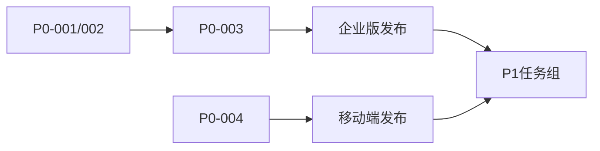

# 🔐 任务管理中心（加密版）

> 此文件使用代码块隐藏敏感信息，仅团队内部可解读
> 更新时间：2025-06-13

## 📋 任务编码说明

```
优先级编码：
🔴 = P0 (紧急)
🟡 = P1 (高)  
🟢 = P2 (中)
🔵 = P3 (低)

模块编码：
LS = License Server
EP = Enterprise  
MC = MCP Client
MS = Main System
```

## 🔴 P0 任务清单

```yaml
P0-001:
  模块: LS
  任务: RSA-SIG-IMPL
  位置: src/services/cryptoService.ts
  状态: pending
  
P0-002:
  模块: LS  
  任务: AES-CRYPTO-IMPL
  位置: src/services/cryptoService.ts:261,270
  状态: pending

P0-003:
  模块: EP
  任务: LICENSE-CHECK-LOGIC
  位置: database/enterprise-init.ts:39
  状态: pending

P0-004:
  模块: MS
  任务: MOBILE-PR-10-FIX
  分支: feature/mobile-optimization
  状态: pending
```

## 🟡 P1 任务清单

```yaml
P1-001:
  代号: AI-REPORT-SYS
  描述: 智能报告生成
  预期: 2025-Q1
  
P1-002:
  代号: AI-BUG-MGR
  描述: 缺陷智能管理
  预期: 2025-Q1

P1-003:
  代号: AI-CLOUD-MEM
  描述: 团队记忆云
  预期: 2025-Q1

P1-004:
  模块: MS
  任务: DB-SNAPSHOT-RESTORE
  位置: lib/storage/database-adapter.ts:594-600
  状态: pending
```

## 🟢 P2 任务清单

```yaml
P2-GROUP-COLLAB:
  - 在线状态显示
  - 光标同步系统  
  - 访问记录追踪

P2-GROUP-AI:
  - AI-RISK-MONITOR
  - AI-CODE-MENTOR
  
P2-GROUP-ARCH:
  - RBAC-IMPL
  - MULTI-TENANT
  - AUDIT-LOG-SYS
```

## 🔵 P3 长期规划

```yaml
P3-MCP-EXPANSION:
  当前: 14
  目标: 71
  时间: 2025-H2

P3-AI-SUITE:
  - AI-TEAM-DASH
  - AI-RETRO-GEN
  - AI-DESIGN-CONV
  - AI-TASK-PLAN
  - AI-HANDOVER
  - AI-ONBOARD

P3-INFRA:
  - GIT-LIKE-VER
  - PAYMENT-STRIPE
  - SSO-FULL
```

## 🐛 技术债务

```yaml
DEBT-001:
  位置: src/business/license/manager.ts:626
  类型: TODO-VERIFY-SIG

DEBT-002:
  位置: scripts/setup-business-architecture.js:164  
  类型: TODO-LICENSE-VAL

DEBT-003:
  位置: enterprise/IMPLEMENTATION-STATUS.md
  类型: TODO-RSA-VERIFY
```

## 📊 进度矩阵

```
模块状态：
[████████░░] MS: 80% 
[██████░░░░] EP: 60%
[████░░░░░░] LS: 40%
[████████░░] MC: 80%
```

## 🔑 关键路径



## 📝 本周聚焦

```yaml
周一二: P0-001 + P0-002
周三四: P0-004  
周五: P0-003 + 测试
```

## 🔒 安全备注

- 所有密钥存储使用环境变量
- RSA 密钥对定期轮换
- 生产配置独立管理
- 定期安全审计

---

💡 快速访问：`/docs/private/TODO-ENCRYPTED.md`