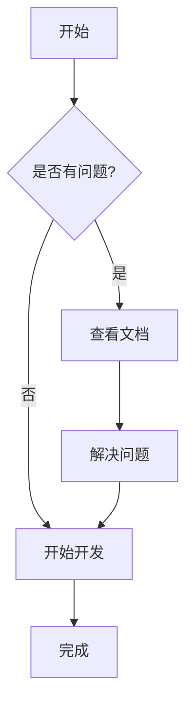

# 文档中心

欢迎来到文档中心！这里包含了项目的所有文档。

## 目录结构

- [快速开始](./getting-started/README.md)
- [API 文档](./api/README.md)
- [教程](./tutorials/README.md)
- [常见问题](./faq.md)

## 特性

- 📝 Markdown 文档支持
- 🔍 全局搜索功能
- 📊 Mermaid 图表支持
- 🌲 目录树导航
- 📱 响应式设计

## Mermaid 图表示例



## 代码示例

```javascript
function hello() {
    console.log("Hello, World!");
}
```

## 表格示例

| 功能 | 状态 | 描述 |
|------|------|------|
| Markdown 渲染 | ✅ | 支持标准 Markdown |
| 代码高亮 | ✅ | 支持多种语言 |
| Mermaid 图表 | ✅ | 支持流程图、时序图等 |
| 全局搜索 | ✅ | 快速查找内容 |
