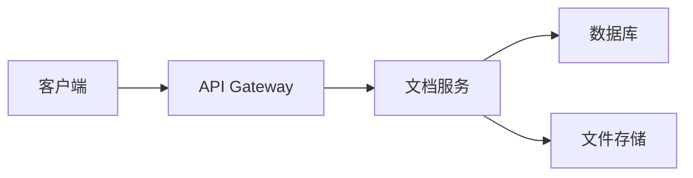

# API 文档

这里是 API 接口文档。

## 概述

我们的 API 提供了完整的文档管理功能。

## 认证

```bash
curl -H "Authorization: Bearer YOUR_TOKEN" \
     https://api.example.com/docs
```

## 端点

### 获取文档列表

```http
GET /api/docs
```

**响应示例：**

```json
{
  "docs": [
    {
      "id": "1",
      "title": "快速开始",
      "path": "/getting-started",
      "lastModified": "2024-01-01T00:00:00Z"
    }
  ]
}
```

### 获取单个文档

```http
GET /api/docs/:id
```

**参数：**

| 参数 | 类型 | 描述 |
|------|------|------|
| id | string | 文档 ID |

## 架构图



## 错误码

| 错误码 | 描述 |
|--------|------|
| 400 | 请求参数错误 |
| 401 | 未授权 |
| 404 | 资源不存在 |
| 500 | 服务器错误 |
