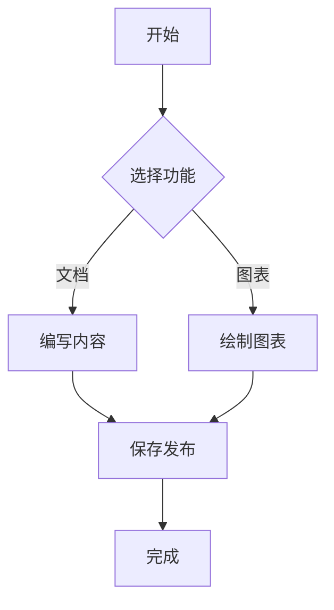
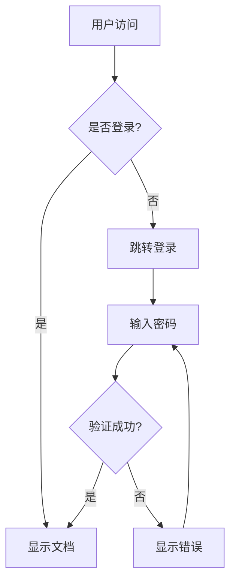
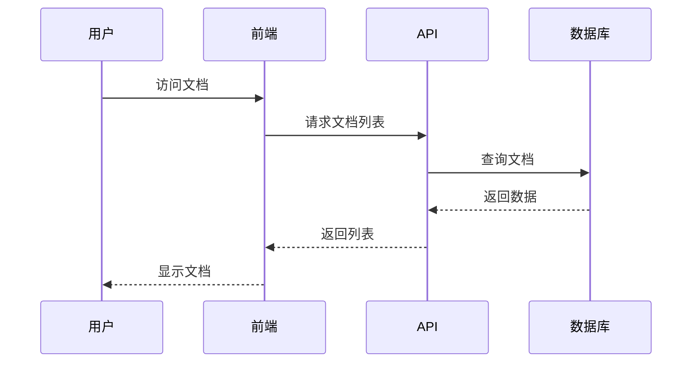
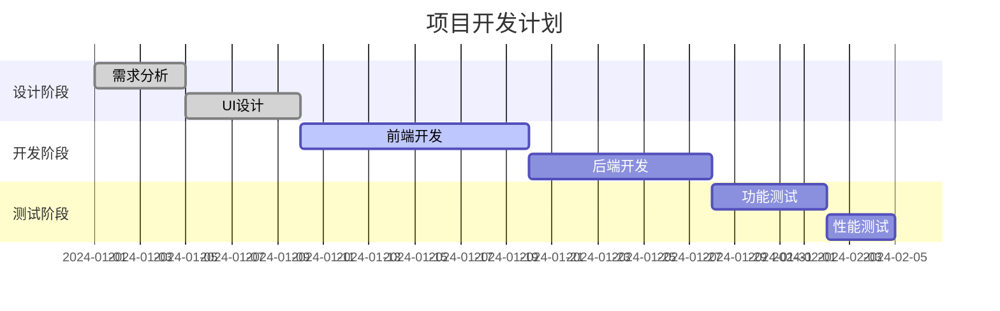

# 🚀 快速开始

欢迎使用现代化 Markdown 文档系统！本指南将帮助你在 5 分钟内快速上手。

## 📋 系统要求

- Node.js 18+
- pnpm / npm / yarn
- 现代浏览器（支持 ES2020+）

## ⚡ 快速安装

### 1. 克隆项目

```bash
git clone https://github.com/leeguooooo/markdown-site
cd markdown-site
```

### 2. 安装依赖

```bash
# 推荐使用 pnpm
pnpm install

# 或者使用 npm
npm install
```

### 3. 启动开发服务器

```bash
pnpm dev
# 或 npm run dev
```

### 4. 访问应用

- 📖 **文档预览**: http://localhost:3001
- ⚙️ **管理后台**: http://localhost:3001/admin
- 🔑 **默认密码**: `admin123`

## 📝 创建你的第一个文档

### 方法一：通过管理后台（推荐）

1. 访问 `/admin` 并登录
2. 点击 "+" 按钮创建新文档
3. 选择模板或从空白开始
4. 使用内置编辑器编写内容
5. 保存并预览

### 方法二：直接创建文件

在 `docs` 目录下创建 `.md` 文件：

```markdown
# 我的第一个文档

欢迎来到我的文档！

## 🎯 目标

这个文档将介绍...

## 📊 数据展示

| 功能 | 状态 | 描述 |
|------|------|------|
| Markdown | ✅ | 完整支持 |
| Mermaid | ✅ | 图表支持 |
| 搜索 | ✅ | 全文搜索 |

## 🔄 流程图



## ✅ 任务列表

- [x] 学习 Markdown 语法
- [x] 了解系统功能
- [ ] 创建项目文档
- [ ] 分享给团队
```

## 🗂️ 组织文档结构

### 推荐的目录结构

```javscript
docs/
├── 📁 项目介绍/
│   ├── README.md          # 项目概述
│   ├── 功能特性.md        # 功能介绍
│   └── 更新日志.md        # 版本历史
├── 📁 快速开始/
│   ├── README.md          # 安装指南
│   ├── 基础配置.md        # 配置说明
│   └── 常见问题.md        # FAQ
├── 📁 API 文档/
│   ├── README.md          # API 概述
│   ├── 认证.md           # 认证方式
│   └── 接口列表.md        # 接口文档
└── 📁 开发指南/
    ├── README.md          # 开发环境
    ├── 代码规范.md        # 编码标准
    └── 部署指南.md        # 部署流程
```

### 文件命名建议

- ✅ 使用中文名称（支持中文路径）
- ✅ 描述性命名：`用户认证.md`
- ✅ 使用 README.md 作为目录首页
- ❌ 避免特殊字符：`<>:"/\|?*`

## 🎨 Markdown 高级功能

### 代码高亮

```javascript
// JavaScript 示例
function createDocument(title, content) {
  return {
    title,
    content,
    createdAt: new Date(),
    author: 'leeguoo'
  };
}
```

```python
# Python 示例
def process_markdown(content):
    """处理 Markdown 内容"""
    return markdown.render(content)
```

### 数学公式

```
行内公式：$E = mc^2$

块级公式：
$$
\sum_{i=1}^{n} x_i = x_1 + x_2 + \cdots + x_n
$$
```

### 提示框

> 💡 **提示**: 使用引用语法创建提示框
>
> 这是一个重要的提示信息。

> ⚠️ **警告**: 注意安全配置
>
> 生产环境请修改默认密码。

> ✅ **成功**: 配置完成
>
> 系统已成功启动！

## 🔍 搜索功能使用

### 搜索技巧

1. **关键词搜索**: 直接输入关键词
2. **标题搜索**: 搜索会优先匹配标题
3. **模糊搜索**: 支持部分匹配和拼写容错
4. **实时搜索**: 输入即搜索，无需按回车

### 搜索快捷键

- `Ctrl/Cmd + K`: 打开搜索框
- `ESC`: 关闭搜索框
- `↑/↓`: 选择搜索结果
- `Enter`: 打开选中文档

## 🎯 Mermaid 图表指南

### 流程图



### 时序图



### 甘特图



## 🛠️ 管理功能

### 文档管理

- **创建**: 支持模板和空白文档
- **编辑**: 实时预览的 Markdown 编辑器
- **删除**: 安全删除确认
- **移动**: 拖拽重组文档结构
- **重命名**: 双击文件名快速重命名

### 文件操作

- **上传**: 拖拽上传 `.md` 文件
- **下载**: 导出文档为 Markdown
- **隐藏**: 临时隐藏文档（管理员可见）
- **排序**: 自定义文档显示顺序

## 🔐 安全配置

### 生产环境部署

1. **修改管理密码**:
```bash
node -e "console.log(require('bcryptjs').hashSync('your-password', 12))"
```

2. **设置环境变量**:
```bash
# .env.local
ADMIN_PASSWORD_HASH=生成的哈希值
JWT_SECRET=随机密钥
NODE_ENV=production
```

3. **启用 HTTPS**:
```bash
# 使用 Nginx 或 Cloudflare
```

## 🎉 下一步

恭喜！你已经掌握了基本使用方法。接下来可以：

1. 📖 [浏览 API 文档](/docs/示例文档/api) - 了解高级功能
2. 🎓 [查看教程](/docs/示例文档/tutorials) - 学习最佳实践
3. 🔧 [配置指南](/docs/示例文档/deployment) - 部署到生产环境
4. ❓ [常见问题](/docs/示例文档/faq) - 解决常见问题

## 💬 获取帮助

- 🐛 [提交 Issue](https://github.com/leeguooooo/markdown-site/issues)
- 💡 [功能建议](https://github.com/leeguooooo/markdown-site/discussions)
- 📧 联系作者: [leeguoo](https://github.com/leeguooooo)

---

**祝你使用愉快！** 🎊

如果这个项目对你有帮助，请给个 ⭐ [Star](https://github.com/leeguooooo/markdown-site) 支持一下！
