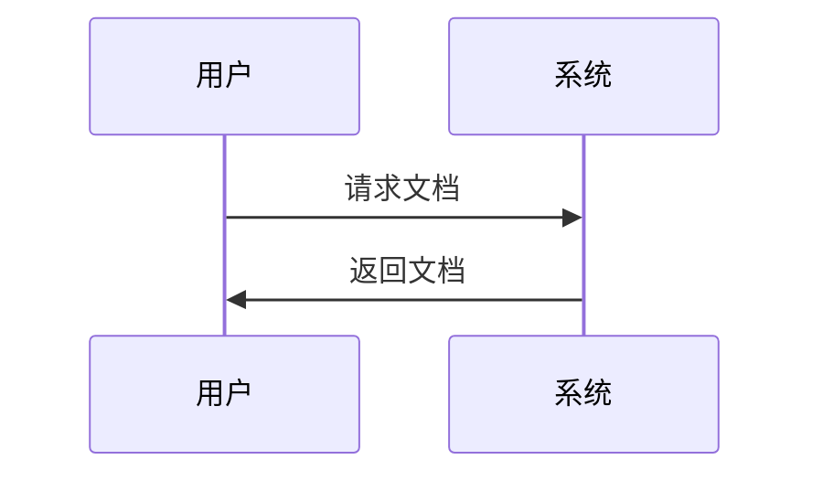

# 快速开始

本指南将帮助你快速上手使用文档系统。

## 安装

```bash
npm install
npm run dev
```

## 基本使用

### 1. 创建文档

在 `docs` 目录下创建 `.md` 文件：

```markdown
# 我的文档

这是一个示例文档。

## 章节

内容...
```

### 2. 组织结构

```
docs/
├── README.md
├── getting-started/
│   ├── README.md
│   └── installation.md
└── api/
    ├── README.md
    └── endpoints.md
```

### 3. 使用 Mermaid



## 搜索功能

使用顶部搜索框可以快速查找文档内容。支持：

- 标题搜索
- 内容搜索
- 模糊匹配

## 导航

- 左侧边栏：目录树导航
- 右侧边栏：当前文档大纲
- 顶部：搜索和主导航
