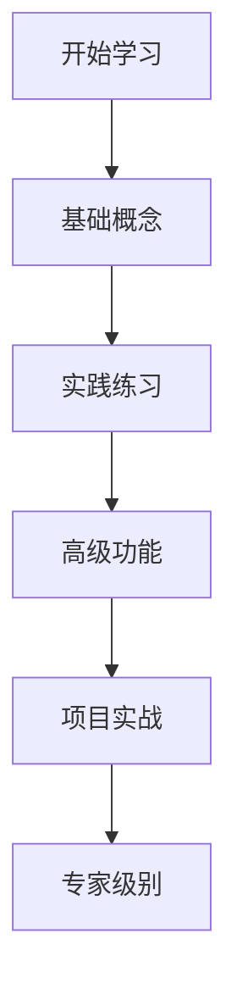

# 教程

这里包含了详细的使用教程。

## 教程列表

1. [基础教程](./basic.md)
2. [高级功能](./advanced.md)
3. [最佳实践](./best-practices.md)

## 学习路径

## 前置要求

- 基本的 Markdown 知识
- 了解 Git 基础操作
- 熟悉命令行操作

## 学习目标

完成所有教程后，你将能够：

- ✅ 熟练使用 Markdown 编写文档
- ✅ 掌握文档组织和管理
- ✅ 使用 Mermaid 创建图表
- ✅ 优化文档的可读性和可维护性
